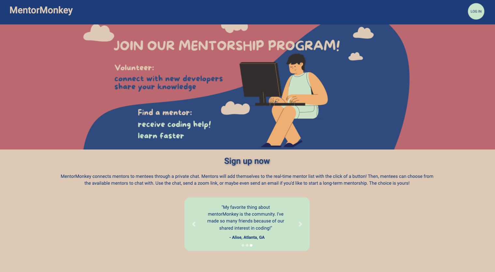
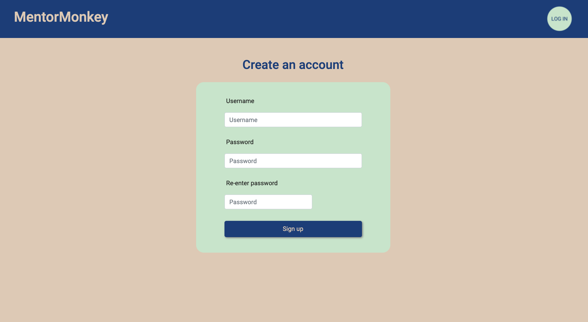
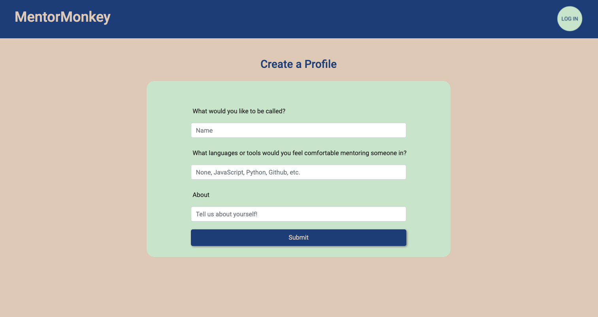
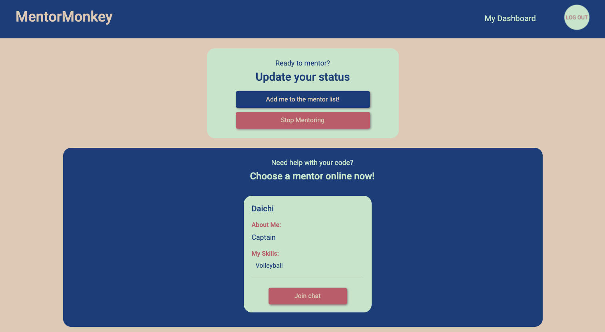
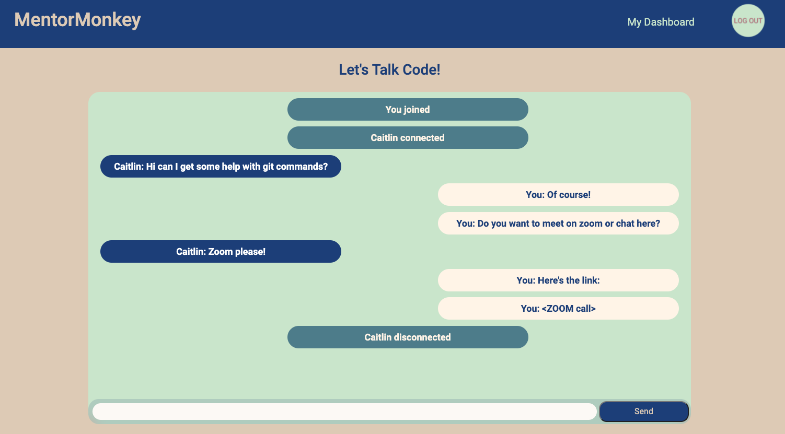

# MentorMonkey

## Description
* MentorMonkey bridges skilled developers with mentees for on-the-spot mentorship 
* Our team designed and built this application using HTML, CSS, JavaScript, Bootstrap, Handlebars, Node.js, Express.js, MySQL, sequelize, and socket.io.
* We deployed to Heroku. 

* [See MentorMonkey live!](https://secret-falls-29125.herokuapp.com/)

## User Story

```md
As a mentee, I want an app that allows me to connect with a mentor so that I can receive help in real-time.
```

```md
As a mentor, I want an app that allows me to offer mentorship according to my own schedule so that I can connect with new developers when I have free time
```

## Screenshots











## Usage

 This is a web-based application that will run in any browser! Simply visit the link above/below.

## Issues
```md
GIVEN: I go to MentorMonkey
WHEN: The landing page loads
THEN: I see the details of the application as well as clear routes to sign up or login

GIVEN: I go to MentorMonkey
WHEN: The landing page loads and I click on the options to signup or login
THEN: I see a form for signups and my user data is stored 

GIVEN: I go to MentorMonkey 
WHEN: I have signed up and created a profile
THEN: I can login using my signup information

GIVEN: I am on MentorMonkey’s site
WHEN: I have logged out or timed out my session
THEN: I can no longer access user features

GIVEN: I am a mentor 
WHEN: I have free time and I am looking at my dashboard
THEN: I can select the option to “become available” for mentees to find me

GIVEN: I am a mentee
WHEN: I need help and am on my dashboard
THEN: I can select an available mentor to chat with

GIVEN: The mentee has joined the chat
WHEN: They arrive to chat
THEN: They create a chat username and can begin chatting with the mentor

GIVEN: The session is finished
WHEN: They exit the chat
THEN: They can mentor again if they are a mentor, or find another mentor when they need one if they are a mentee
 ```

## License

This project is licensed under: [MIT](https://opensource.org/licenses/MIT)

## Contribution

* [Caitlin Wall](https://github.com/caitlinw29): caitlinwall96@gmail.com
* [Steph Fajardo](https://github.com/stephtf): stfajardo@gmail.com
* [Steven Lofquist](https://github.com/StevenLof777): lof.steven@gmail.com
* [Alisa Wolfram](https://github.com/ealisa818): ealisa818@gmail.com
    
## Deployed Link

* [See MentorMonkey live!](https://secret-falls-29125.herokuapp.com/)
#### Thank you for checking out our project!
